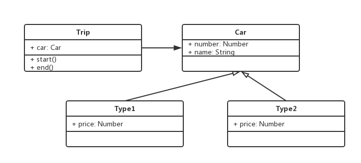

### 1. Build development environment

1. Initiate npm environment:
`npm init` to create 'package.json';

2. Install webpack:
2.1. `npm i --save-dev webpack webpack-cli`, and create 'webpack.dev.config.js',
2.2. in 'package.json' file, code `"dev": "webpack-dev-server --config ./webpack.dev.config.js --mode development"`, and then run `npm run dev` in terminal, which to create the 'bundle.js' in 'release' folder for development mode.

3. Install webpack-dev-server:
3.1. run `npm i --save-dev webpack-dev-server html-webpack-plugin` to install 'webpack-dev-server' and 'html-webpack-plugin',
3.2. `plugins: [ new HtmlWebpackPlugin({template: './index.html'}) ]` means create one template named 'index.html', and the 'release/bundle.js' will put in the template 'index.html' and run.
3.3. `devServer: {....}` means that it will create one server and open on localhost:9000, and the browser will open and renew automatically.

4. Install babel:
4.1 run `npm i --save-dev babel-core babel-loader babel-polify babel-preset-es2015 babel-preset-latest`,
4.2 create '.babelrc' json file,
4.3. and execute 'babel-preset-es2015'.

5. The whole process:
in 'webpack.dev.config.js' file 'entry' is the source code, 'output' is the development file in 'plugins' file, and 'module' used for test es2015 syntax .js file and transfer to es5 file. At last, 'devServer' will create web server to open and renew the 'index.html' page on 'localhost:9000'.

### 2. Object-Oriented Programming

#### 2.1 Have a glance

##### Concepts:
'Class' is one javascript object, including property and method.
```
class People {
  constructor(name, age) {
    this.name = name;
    this.age = age;
  }
  eat() {
    console.log(`${this.name}` eat sth);
  }
  speak() {
    console.log(`my name is ${this.name}, age ${this.age}`);
  }
}
```

here, 'People' is class, 'name' and 'age' are properties, and 'eat' and 'speak' are methods;

'object' is the instance of 'class', and 'class' is one class of 'objects'.
```
let Rick = new People('Rick', 30);
Rick.eat();
Rick.speak();
```
here, 'Rick' has name and age, and can eat and speak, which means that 'Rick' can do anything the class 'People' has.

##### Three Elements:

Inheritance: the child class inherits from parent one;
Encapsulation: keep some data secret, and control authority;
Polym: same interface have different application.

Inheritance is used most in Javascript.

```
class Student extends People {
  constructor(name, age, number) {
    super(name, age);
    this.number = number;
  }
  study() {
    console.log(`${this.number} is my number`);
  }
}
```
here, class Student inherits from class People, and its properties 'name' and 'age' inherits from People, but it also has own property 'number'.

Inheritance can extract the common methods.

'public' for public, 'protected' for children public, and 'private' for itself public.

here, we can show 'typescript',

```
class People {
  name
  age
  protected weight // public for its children
  constructor(name, age) {
    this.name = name;
    this.age = age;
    this.weight = 120;
  }
  eat() {
    console.log(`${this.name} eat`);
  }
  speak() {
    console.log(`I said my age is ${this.age}`);
  }
}

class Stu extends People {
  number
  private girlfriend // only public for itself
  constructor(name, age, number) {
    super(name, age);
    this.number = number;
    this.girlfriend = 'jing';
  }
  study() {
    console.log(`${this.number} study`);
  }
  getWeight() {
    // this.weight can get from its parent class
    console.log(`${this.weight}`);
  }
}

let rick = new Stu('rick', 20, 300);
rick.getWeight();

// the following codes are error
console.log(rick.weight);
console.log(rick.girlfriend);
```

In JS, we can write prefix "_" with property for private property, such as '_girlfriend'.

Polym means that we define one interface (method), and we can realize it in different way in children class, such as 'saySth'

```
class People {
  constructor(name) {
    this.name = name;
  }
  saySth() {

  }
}

class A extends People {
  constructor(name) {
    super(name);
  }
  saySth() {
    console.log('I am A');
  }
}

class B extends People {
  constructor(name) {
    super(name);
  }
  saySth() {
    console.log('I am B'); 
  }
}

let a = new A('a');
let b = new B('b');
a.saySth(); // i am a
b.saySth(); // i am b

```
One sample coded in 'jQuery-sample1.js', here, we define jQuery class, and use constructor and methods to realize the object 'p' inherited from jQuery.

See 'have-glance1.js' and 'have-glance2.js'.

why we use Object-Oriented?

programming run under the following process:
(sequence, judgement, loop) construct.
oo: data constructoring.
computer believe contructored one is simple one.

#### 2.2 UML - Unified Modeling Language

Based on we talked before, we can give one UML diagram for 'People' class, including name and age properties and eat and speak methods.


And also give the relationship between classes, cluding inheritance and association.
```
class People {
  constructor(name, house) {
    this.name = name;
    this.house = house;
  }
  saySth() {}
}

class A extends People {
  constructor(name, house) {
    super(name, house);
  }
  saySth() {
    console.log('I am A');
  }
}

class B extends People {
  constructor(name, house) {
    super(name, house);
  }
  saySth() {
    console.log('I am B');
  }
}

class House {
  constructor(city) {
    this.city = city;
  }
  showCity() {
    console.log(`house in ${this.city}`);
  }
}

let ahouse = new House('mel');
let a = new A('a', ahouse);
a.saySth();
let b = new B('b');
b.saySth();
```
here, A and B inherits from People, and House associates with People.


See 'uml3.js'

#### 2.3 Design Philosophy

##### What's design?
1. Realize some functions based on some thought
2. Based on different projects to realize same function;
3. Combined with more increasingly needs, design become more important;

##### Following some philosophies
1. Small is beautiful;
2. Make each program do one thing well;
3. To do a new job, build afresh rather than complicate old programs by adding new "features";
4. Expect the output of every program to become the input to another, as yet unknown, program;
5. Write programs to handle text streams, because that is a universal interface;
6. Write programs to work together;
7. Build a prototype as soon as possible;
8. Choose portability over efficiency.

##### SOLID principles:
S - Single-responsiblity principle:
A class should have one and only one reason to change, meaning that a class should have only one job, which means that one project or class only focus one function.

O - Open-closed principle:
Objects or entities should be open for extension, but closed for modification, which means extend the new codes instead of modify the old codes when increas needs.

L - Liskov substitution principle:
 every subclass/derived class should be substitutable for their base/parent class.

I - Interface segregation principle:
A client should never be forced to implement an interface that it doesn't use or clients shouldn't be forced to depend on methods they do not use, here JS use less.

D - Dependency Inversion Principle:
Entities must depend on abstractions not on concretions. It states that the high level module must not depend on the low level module, but they should depend on abstractions, which means we focus on what the interface but not the how, JS use less.

in file 'S-O-sample.js', each 'then' only focus one thing, and if increas needs, thus increase 'then'

Here have two samples to show how to analyze class by UML.



See 'o-s-sample.js', 'sample5.js' and 'sample6.js'


#### 2.4 Design Pattern

##### 2.4.1 Introduction
It contains 23 kinds of design pattern, which are,
Creational Patterns: Factories, Singleton and Prototype,
Structural Patterns: Adapter, Decorator, Proxy, Facade and (Bridge, Composite, Flyweight),
Behavioral Patterns: Observer, Iterator, State and (Chain of Resp, Command, Mediator, Memento, Strategy, Template, Visitor)

Here

##### 2.4.2 

将 new 操作单独封装
遇到new的时候，就要考虑工厂模式


